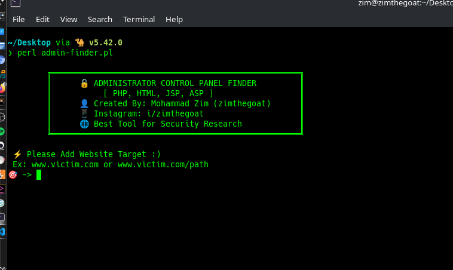
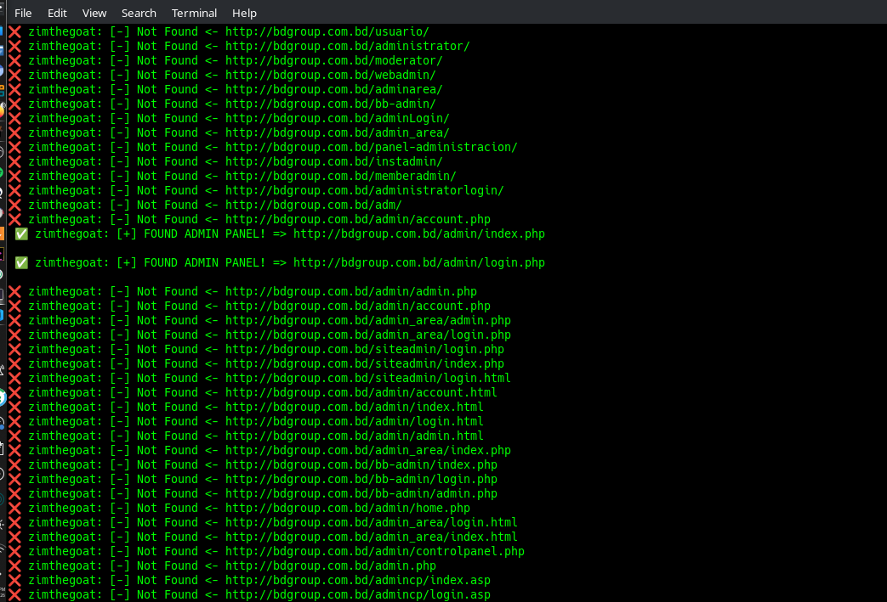

  
  
  
  
  

---

# 🔍 Admin Panel Finder (Perl)

Powerful **Admin Panel Finder** written in Perl for discovering hidden admin login pages on websites.

Designed for **penetration testers**, **bug bounty hunters**, and **cybersecurity students**.

---

## ⚡ Features

- Fast brute-force directory scanning  
- Built-in admin path wordlist  
- Custom wordlist support  
- Colored terminal output  
- Simple CLI usage  
- Lightweight & portable  
- Auto-detect valid pages  

---

## 🖥️ Screenshot

